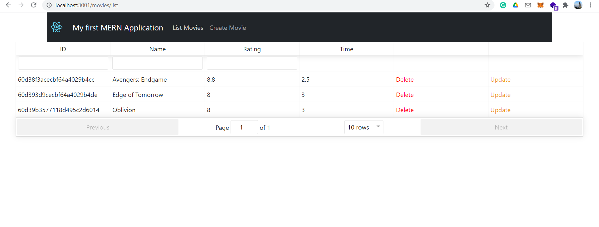
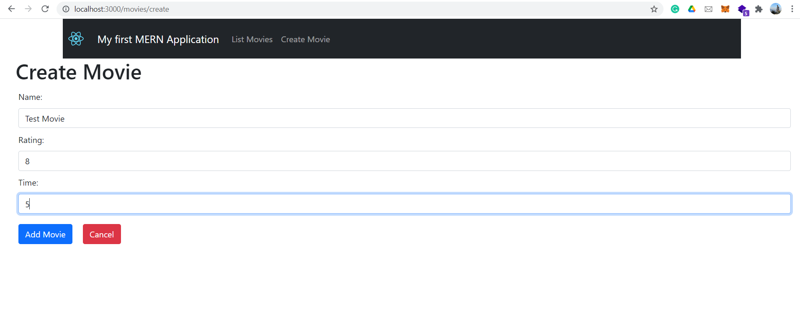
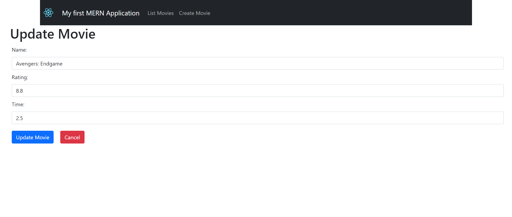
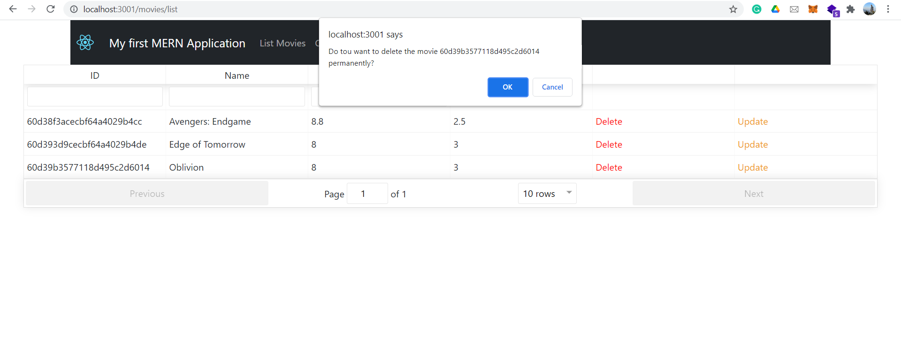

# Movies CRUD Application based on MERN Stack

## Steps to run the project
* Clone the repo
* Install dependencies required for our server using ```cd sever && npm i```
* Install dependencies of frontend using ```cd frontend && npm i```
* Run server and frontend one by one using ```npm start``` (or ```nodemon``` if you have it installed globally)
* Done


## Following screenshots representing the UI of the Application

### List movies




### Create movie




### Update movie




### Delete movie


